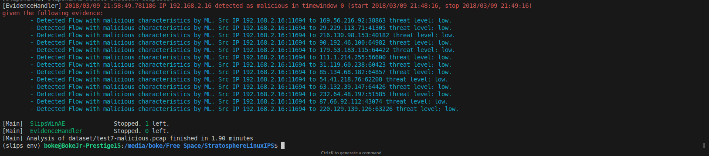

<h1 align="center">Slips v1.1.10</h1>

---

## Índice

* [Estructura](#estructura)
* [Uso](#uso)
* [Evaluaciones](#evaluaciones)
* [Interfaz de Usuario](#interfaz-de-usuario)

  * [Interfaz Web](#interfaz-web)
  * [Kalipso (CLI)](#kalipso-cli)
* [Requisitos](#requisitos)
* [Configuración](#configuración)
* [Licencia](#licencia)

---

## Estructura

Dentro de la arquitectura existente de **SLIPS** (v1.1.10) se incluye la implementación del módulo `slipswinae`. La estructura de carpetas y archivos es la siguiente:

```text
modules/
└─ slipswinae/
   ├─ slipswinae.py
   ├─ zeekflowae.py
   ├─ ae.keras
   ├─ scaler.joblib
   ├─ mbkmeans.joblib
   ├─ isof_latent.joblib
   ├─ lof_latent.joblib
   ├─ hst.joblib
   ├─ feature_info.json
   ├─ test/
   │  ├─ slipswinae_evaluator.py
   │  ├─ flowmldetection_evaluator.py
   │  ├─ thursday_conn_labeled.log
   │  ├─ friday_conn_labeled.log
   │  └─ results/
   │     ├─ friday_data/
   │     ├─ ae_if/
   │     │  ├─ ae_if_metrics.csv
   │     │  ├─ AE+IF_minmax_weighted_a=0.9_roc.png
   │     │  ├─ AE+IF_minmax_weighted_a=0.9_pr.png
   │     │  └─ … (otras curvas y métricas)
   │     ├─ ae_hst/
   │     │  ├─ ae_hst_metrics.csv
   │     │  ├─ AE+HST_ecdf_weighted_a=0.9_roc.png
   │     │  ├─ AE+HST_ecdf_weighted_a=0.9_pr.png
   │     │  └─ … (otras curvas y métricas)
   │     └─ … (otros experimentos)
```

*Todo lo que no pertenezca a esta estructura corresponde a la arquitectura general de **SLIPS** y no forma parte de esta implementación.*

---

## Uso

A continuación se muestran los pasos necesarios para **reproducir** la implementación, ya sea entrenando de nuevo los modelos o efectuando una prueba de detección.

### 1. Entrenamiento

> **Advertencia:** El archivo original de entrenamiento `benign_merged.pcap` no se versiona debido a que pesa mas de 15Gb.

SLIPS utiliza **aprendizaje no supervisado**, por lo que el entrenamiento **solo** requiere ejemplos de tráfico benigno. El archivo `config/slips.yaml` ya define por defecto la etiqueta `label: normal`, así que no es necesario ajustarla.

1. Abre `config/slips.yaml` y ajusta el parámetro `mode` del módulo `flowmldetection` a `train`:

   ```yaml
   flowmldetection:
     mode: train
   ```
2. Ejecuta el entrenamiento utilizando el archivo pcap beningno:

   ```bash
   ./slips.py -c config/slips.yaml \
              -f modules/slipswinae/training/datasets/benign_training_dataset.pcap \
              -v 0 -e 1
   ```
3. *(Opcional)* En un entorno controlado con tráfico benigno, entrena desde la interfaz de red (por ejemplo `eth0`):

   ```bash
   ./slips.py -c config/slips.yaml -i eth0
   ```

> **Advertencia:** Cada reentrenamiento **sobrescribirá** los modelos existentes con los nuevos generados.

---

### 2. Prueba de detección

1. En `config/slips.yaml`, cambia `mode` a `test`:

   ```yaml
   flowmldetection:
     mode: test
   ```
2. Ejecuta la detección sobre un pcap con tráfico malicioso:

   ```bash
   ./slips.py -c config/slips.yaml \
              -f dataset/test7-malicious.pcap \
              -v 0 -e 1
   ```
<p align="center">
  
</p>

La salida se almacena en la carpeta `output/test7-malicious.pcap_2025-06-10_21-55-22` en concreto en el archivo `alerts.json`

Con la configuración por defecto, los módulos `flowmldetection` y `slipswinae` están activos, por lo que verás las evidencias detectadas en la salida.

---

### Alternar entre modos

Modifica únicamente el valor de `mode` en la sección `flowmldetection` de `config/slips.yaml`:

```yaml
flowmldetection:
  mode: train  # o 'test'
```

---

## Evaluaciones

Para **reproducir** las evaluaciones automatizadas incluidas en este repositorio, ejecuta los siguientes scripts:

* **Implementación SlipsWInAE (solo combinación ganadora):**

  ```bash
  python3 modules/slipswinae/test/slipswinae_evaluator.py
  ```
* **Implementación original FlowMLDetection (módulo de SLIPS):**

  ```bash
  python3 modules/slipswinae/test/flowmldetection_evaluator.py
  ```

---

## Interfaz de Usuario

### Interfaz Web

Por defecto SLIPS ofrece dos posibles interfaces de usuario además de la salida general por consola:

```bash
./webinterface.sh
```

Abre tu navegador en [http://localhost:55000](http://localhost:55000).

Para más información, consulta la [documentación oficial](https://stratospherelinuxips.readthedocs.io/en/develop/usage.html#the-web-interface).

### Kalipso (CLI)

```bash
./kalipso.sh
```

Para más detalles, revisa la [documentación de Kalipso](https://stratospherelinuxips.readthedocs.io/en/develop/usage.html#kalipso).

---

## Requisitos

* **Python** 3.10.12
* **RAM:** mínimo 4 GB

Además de los requisitos de hardware es necesario instalar los requisitos de software, para ello:

Ubicándonos en la carpeta raíz del proyecto

* **Crear entorno virtual**
```bash
python3 -m venv slips_env
```

* **Activar directorio virtual**
```bash
source slips_env/bin/activate
```

* **Instalar requisitos**
```bash
pip install -r install/requirements.txt
```

---

## Configuración

SLIPS utiliza el archivo [`config/slips.yaml`](https://github.com/stratosphereips/StratosphereLinuxIPS/blob/develop/config/slips.yaml) para ajustar todos los parámetros. En concreto esta implementación modifica:

| Parámetro            | Descripción                                            |
| -------------------- | ------------------------------------------------------ |
| `time_window_width`  | Ancho de la ventana temporal  (60 s).                          |
| `label` | `Normal` por defecto, para entrenamiento no supervisado con datos benignos |
| `mode`               | `train` o `test` para alternar entre modos.               |
| `disabled`               | Para desactivar todos los módulos excepto `flowmldetection` y `slipswinae`               |

---

## Licencia

Distribuido bajo la [GNU GPL v3.0](https://github.com/stratosphereips/StratosphereLinuxIPS/blob/master/LICENCE)

---